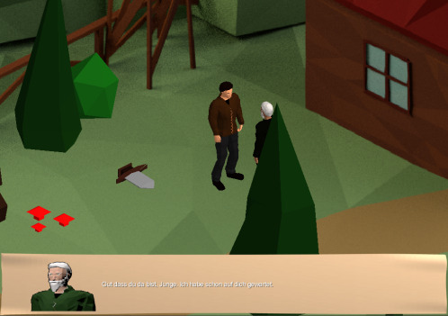
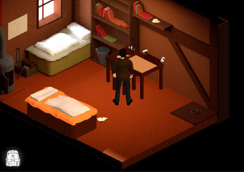
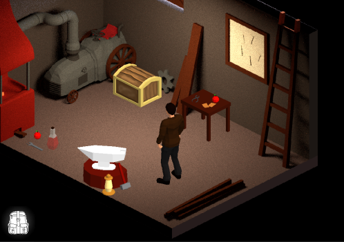
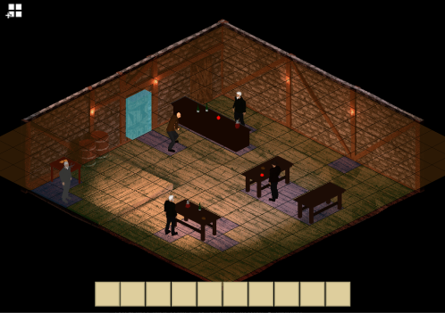
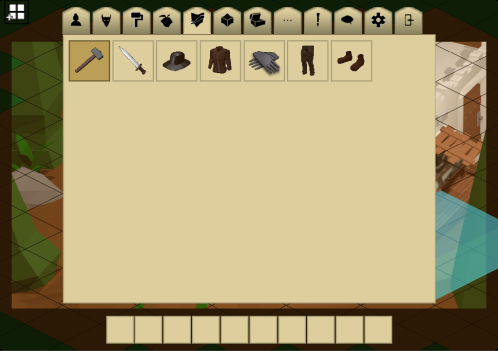

# Lands of Cinder

This is an isometric role-playing game for desktops and Android based on [libGDX](https://github.com/libgdx/libgdx).
A big part is allowing users to create content for the game with the inbuilt editor and sharing tools.
The online component, which consists of a node based server, is hosted [here](https://github.com/boonto/locserver).
However, it is pretty buggy, and I commented out those parts.

It was created as a student project over one year 2015 to 2016 at Nuremberg Institute of Technology by Philipp Schönhuth, Willi Schorrig, Andreas Vogl and me.
We wanted to continue after the project but with theses and work there was no more time left.
Although we tried to keep the code pretty clean, this was in our early programming days,
and with deadlines and quick fixes there is definitely a lot of cruft. There are a lot of bugs and specific actions that lead to game crashes.

Our main motivation was to learn and get insights into many of the aspects of game development,
which led to the decision of using a smaller framework like libGDX instead of a more advanced game engine.
This way, we had a lot to implement which is usually provided by the engine, but nothing too deep.

Features of the game:

- Grid based movement with A* pathfinding and steering
- Basic turn based combat system with skills and enemy "AI"
- Quest and dialog system
- Item, inventory and stat system
- Access to online content created by other users
- Isometric 3D graphics on 2D backgrounds and particles
- Triggered sounds and music
- XML based description for everything

Features of the editor:

- Level editor with a selection of entities and backgrounds
- Each entity can be modified and given dialog
- Quest + dialog editor
- Uploading and hosting levels on the server
- Support for height maps for more complicated backgrounds

A lot of work, and definitely fun, went into all the aspects of the game:

- Programming, of course
- Ingame sounds, which were created in a studio during an Audio project
- Models and prerendered backgrounds, with Blender
- Animations, with Blender (some of them might by free Animations by Mixamo, I don't remember if we replaced them)
- Songs were composed and produced by Willi
- Concept drawings & story
- Animated spotlights for marketing
- Posters for each of the end of semester presentations

In the `stuff/` directory a lot of the source material for the mentioned media is available.

### How to start?

- For Desktop run `./gradlew desktop:run`.
- For Android run `./gradlew installDebug` with an Android device connected or an emulator running.
- You can also import it into an IDE and go through `DesktopLauncher` or `AndroidLauncher`

### Screenshots

